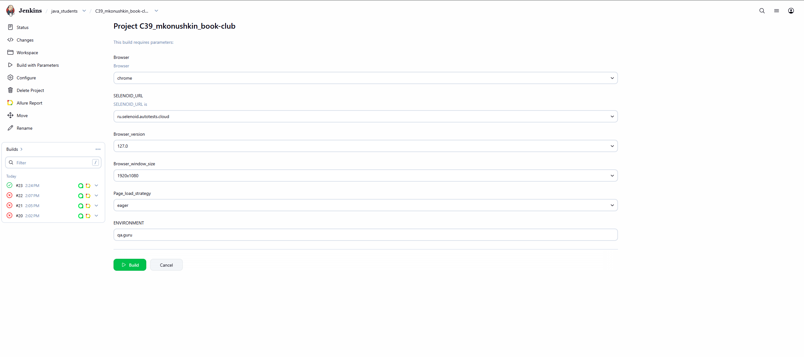
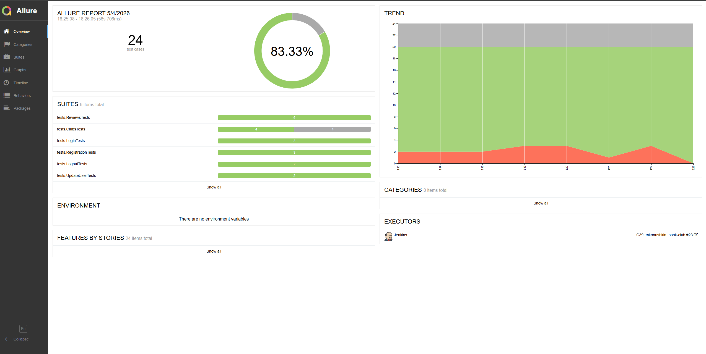
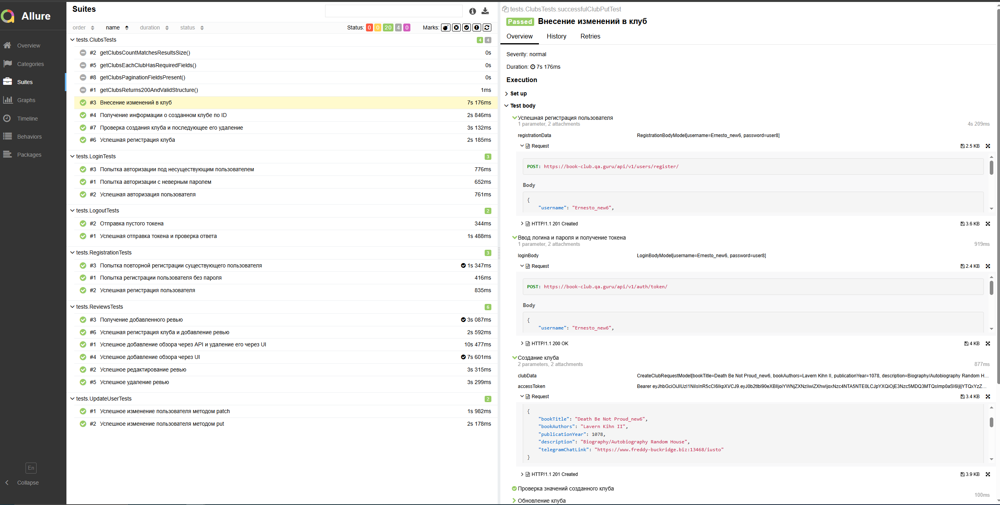
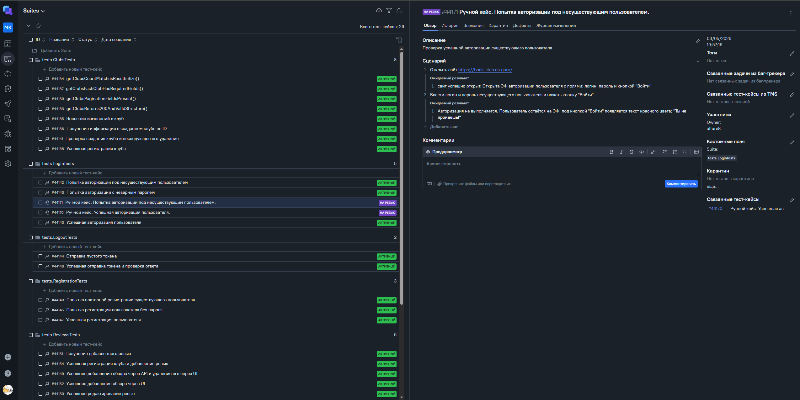
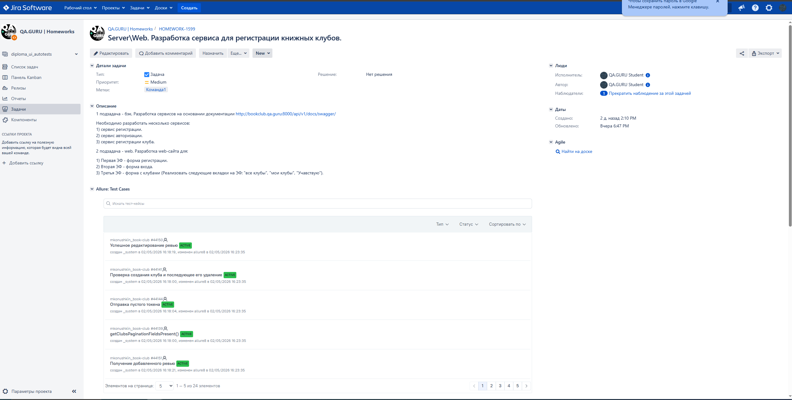
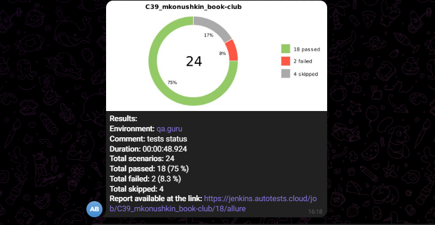

# Проект по автоматизации тестирования для ["book-club"](https://book-club.qa.guru).

## :pushpin: Содержание:

- <a href="#tools">Технологии и инструменты</a>
- <a href="#jenkins">Сборка в Jenkins</a>
- <a href="#allure">Пример Allure-отчета</a>
- <a href="#telegram">Уведомление в Telegram при помощи бота</a>

## :computer: Использованный стек технологий

- В данном проекте автотесты написаны на языке <code>Java</code> с использованием фреймворка для тестирования Selenide.
- В качестве сборщика был использован - <code>Gradle</code>.
- Использованы фреймворки <code>JUnit 5</code> и [Selenide](https://selenide.org/).
- При прогоне тестов браузер запускается в [Selenoid](https://aerokube.com/selenoid/).
- Для удаленного запуска реализована джоба в <code>Jenkins</code> с формированием Allure-отчета и отправкой результатов в <code>Telegram</code> при помощи бота.

##  Сборка в [Jenkins](https://www.jenkins.io).

##  Пример [Allure-отчета](https://allurereport.org)
### Overview

### Результат выполнения теста

##  Интеграция с [Allure TestOps](https://allure.autotests.cloud)

Выполнена интеграция сборки <code>Jenkins</code> с <code>Allure TestOps</code>.
Результат выполнения автотестов отображается в <code>Allure TestOps</code>
На Dashboard в <code>Allure TestOps</code> отображена статистика пройденных тестов.

##  Интеграция с [Jira](https://jira.autotests.cloud)

Реализована интеграция <code>Allure TestOps</code> с <code>Jira</code>, в тикете отображается информация, какие тест-кейсы были написаны в рамках задачи и результат их прогона.

##  Уведомления в Telegram с использованием бота

После завершения сборки, бот созданный в <code>Telegram</code>, автоматически обрабатывает и отправляет сообщение с результатом.

